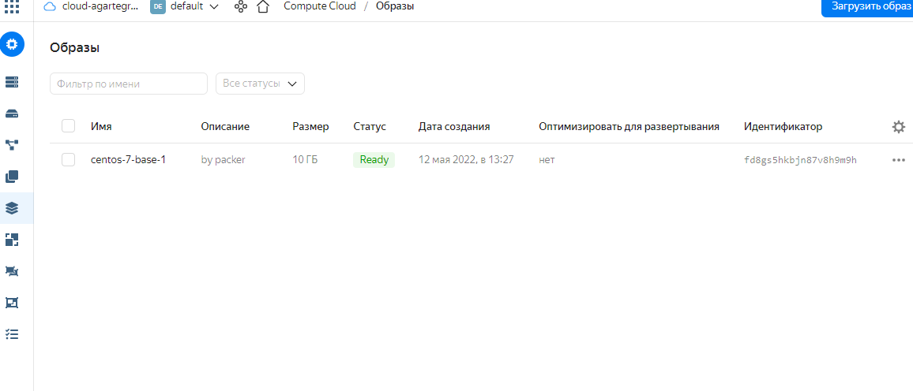
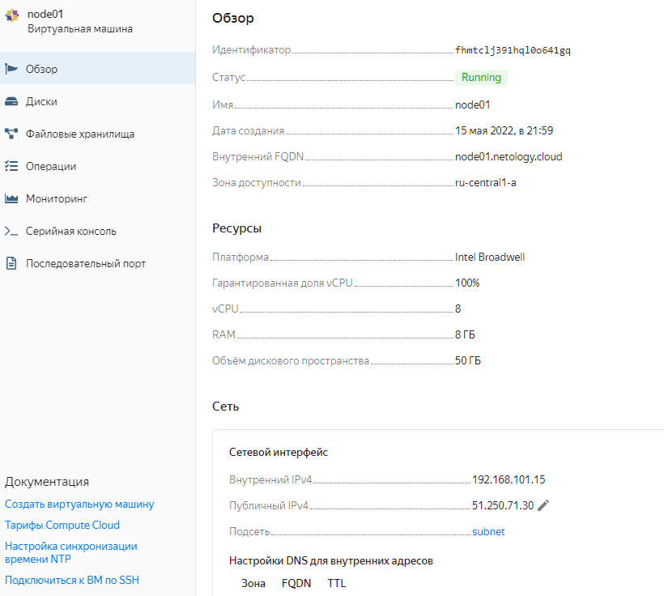

# Домашнее задание к занятию "5.4. Оркестрация группой Docker контейнеров на примере Docker Compose"


## Задача 1

Создать собственный образ операционной системы с помощью Packer.

Для получения зачета, вам необходимо предоставить:
- Скриншот страницы, как на слайде из презентации (слайд 37).
### Ответ
образ создан по материалам из лекции
```bash
 yc compute image list
+----------------------+-----------------+--------+----------------------+--------+
|          ID          |      NAME       | FAMILY |     PRODUCT IDS      | STATUS |
+----------------------+-----------------+--------+----------------------+--------+
| fd8gs5hkbjn87v8h9m9h | centos-7-base-1 | centos | f2esd9f5o5i9p7pkkk8k | READY  |
+----------------------+-----------------+--------+----------------------+--------+
```
<p align="center">
  
</p>

## Задача 2

Создать вашу первую виртуальную машину в Яндекс.Облаке.

Для получения зачета, вам необходимо предоставить:
- Скриншот страницы свойств созданной ВМ, как на примере ниже:
### Ответ
Так же взята из репоитария домашнего задания , поменены параметры в часности имя образа, и все id.
```bash
$ terraform apply   
Terraform used the selected providers to generate the following execution plan. Resource actions are indicated with the following symbols:
  + create
...
Apply complete! Resources: 3 added, 0 changed, 0 destroyed.
Outputs:
external_ip_address_node01_yandex_cloud = "51.250.67.220"
internal_ip_address_node01_yandex_cloud = "192.168.101.3"
```
<p align="center">
  
</p>

## Задача 3

Создать ваш первый готовый к боевой эксплуатации компонент мониторинга, состоящий из стека микросервисов.

Для получения зачета, вам необходимо предоставить:
- Скриншот работающего веб-интерфейса Grafana с текущими метриками, как на примере ниже
### Ответ
- Так же все из репозитария .. была проблема с ключами .. но решилась их перевыпуском.
```bash
# ansible-playbook  provision.yml

PLAY [nodes] ***********************************************************************************************************************************************************************************************************************************************************************************

TASK [Gathering Facts] *************************************************************************************************************************************************************************************************************************************************************************
The authenticity of host '51.250.4.88 (51.250.4.88)' can't be established.
ECDSA key fingerprint is SHA256:NG8zyV3O7r5YyKo0x8KaY4iKJehPdnX4sB2fwFj+QLQ.
Are you sure you want to continue connecting (yes/no/[fingerprint])? yes
ok: [node01.netology.cloud]

TASK [Create directory for ssh-keys] ***********************************************************************************************************************************************************************************************************************************************************
ok: [node01.netology.cloud]

TASK [Adding rsa-key in /root/.ssh/authorized_keys] ********************************************************************************************************************************************************************************************************************************************
changed: [node01.netology.cloud]

TASK [Checking DNS] ****************************************************************************************************************************************************************************************************************************************************************************
changed: [node01.netology.cloud]

TASK [Installing tools] ************************************************************************************************************************************************************************************************************************************************************************
changed: [node01.netology.cloud] => (item=['git', 'curl'])

TASK [Add docker repository] *******************************************************************************************************************************************************************************************************************************************************************
changed: [node01.netology.cloud]

TASK [Installing docker package] ***************************************************************************************************************************************************************************************************************************************************************
changed: [node01.netology.cloud] => (item=['docker-ce', 'docker-ce-cli', 'containerd.io'])

TASK [Enable docker daemon] ********************************************************************************************************************************************************************************************************************************************************************
changed: [node01.netology.cloud]

TASK [Install docker-compose] ******************************************************************************************************************************************************************************************************************************************************************
changed: [node01.netology.cloud]

TASK [Synchronization] *************************************************************************************************************************************************************************************************************************************************************************
changed: [node01.netology.cloud]

TASK [Pull all images in compose] **************************************************************************************************************************************************************************************************************************************************************
changed: [node01.netology.cloud]

TASK [Up all services in compose] **************************************************************************************************************************************************************************************************************************************************************
changed: [node01.netology.cloud]

PLAY RECAP *************************************************************************************************************************************************************************************************************************************************************************************
node01.netology.cloud      : ok=12   changed=10   unreachable=0    failed=0    skipped=0    rescued=0    ignored=0


```

<p align="center">
  
</p>

## Задача 4 (*)

Создать вторую ВМ и подключить её к мониторингу развёрнутому на первом сервере.

Для получения зачета, вам необходимо предоставить:
- Скриншот из Grafana, на котором будут отображаться метрики добавленного вами сервера.
